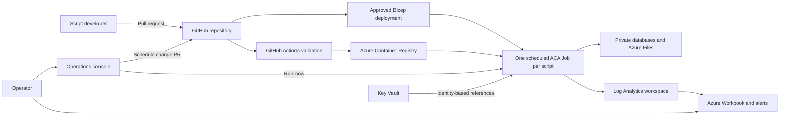

# Architecture

## Context

Approximately 60 independently developed Python scripts currently run from a shared server under SQL Agent. Production files are edited in place. The target platform adds version control, repeatable builds, scheduling, monitoring, and controlled operations while preserving the scripts' current behavior.

## Components

## Execution Contract

Each job directory contains an unchanged Python entry script and a `job.json` manifest. The manifest controls ownership, schedule, timeout, resources, retries, secrets, and mounts. CI validates this contract without importing or executing the script.

The container starts `batchjobs-run`, which launches the configured script using the same Python interpreter. Lifecycle records are emitted as compact JSON to standard error. Script standard output remains unchanged, and the child exit code becomes the container exit code.

Before starting the script, the runner acquires a renewable lease on a job-specific blob. A held lease produces `skipped_overlap` without executing the script. Failure to acquire, renew, or release the coordination lease is a platform failure rather than an application failure. Local runs omit `BATCHJOBS_LOCK_CONTAINER_URL` and use a no-op lock; deployed jobs must supply the container URL and managed identity.

Each production job will be a separate scheduled Container Apps Job resource with one replica and a fixed command. This preserves per-job status, timeout, access, and resource settings while allowing many jobs to reference the same image digest. The same resource also supports manual starts for run-now operations.

## Scheduling

Container Apps Jobs own scheduled invocation. Each manifest stores one standard five-field cron expression in `cronExpressionUtc`; Azure evaluates it in UTC. The platform does not apply time-zone or daylight-saving conversion. Schedule changes modify the manifest through a pull request and deploy only after approval.

## Networking and Data

The Container Apps workload-profile environment will use a dedicated delegated subnet in the target network. Private DNS, routes, NSGs, firewall rules, and outbound policy must be verified against the selected pilot's database and file dependencies.

Required ODBC drivers are installed in the image compatibility group. Persistent file paths use Azure Files mounts. Local container storage is ephemeral. Existing non-Azure shares require migration or synchronization to Azure Files, or a separate compatibility decision.

## Identity and Secrets

Runtime jobs, deployment automation, and the operations console use separate managed identities or federated identities. Access is granted at the smallest practical scope. Secrets remain in Key Vault and are exposed only through Container Apps Key Vault references as environment values or mounted files.

GitHub Actions authenticates to Azure through workload identity federation. No Azure client secret belongs in GitHub.

## Observability

Container Apps console and system logs flow to Log Analytics. The runner adds records for start, completion, failure, timeout, lock failure, rejection, and overlap skip. The Container Jobs Operations workbook provides fleet and per-job views; scheduled-query alerts detect failures, timeouts, stale jobs, and opt-in repeated overlap skips. Notification routing uses optional existing Azure Monitor Action Groups.

Application Insights SDK instrumentation is not required for the baseline because that would change application code and Container Apps does not provide an Application Insights auto-instrumentation agent for these jobs.

## Delivery Sequence

1. Inventory and select one representative script.
2. Prove the unchanged-script runtime contract locally.
3. Add Bicep for a non-production Azure foundation and one job.
4. Add generated native UTC schedules and Log Analytics queries.
5. Validate private connectivity, ODBC, files, secrets, alerts, overlap prevention, and rollback.
6. Shadow the SQL Agent run, compare outputs, and cut over after owner approval.
7. Migrate remaining jobs in risk-based waves.

## Open Inputs

- Azure tenant, subscription, region, naming, tagging, and landing-zone policy
- Existing VNet, DNS, firewall, VPN/ExpressRoute, and private endpoint topology
- Database engines and exact Linux ODBC drivers
- Existing share inventory and Azure Files migration approach
- GitHub organization, teams, environments, and approval policy
- Operator alert destinations and log retention requirements
- First production-shaped pilot and its owner
